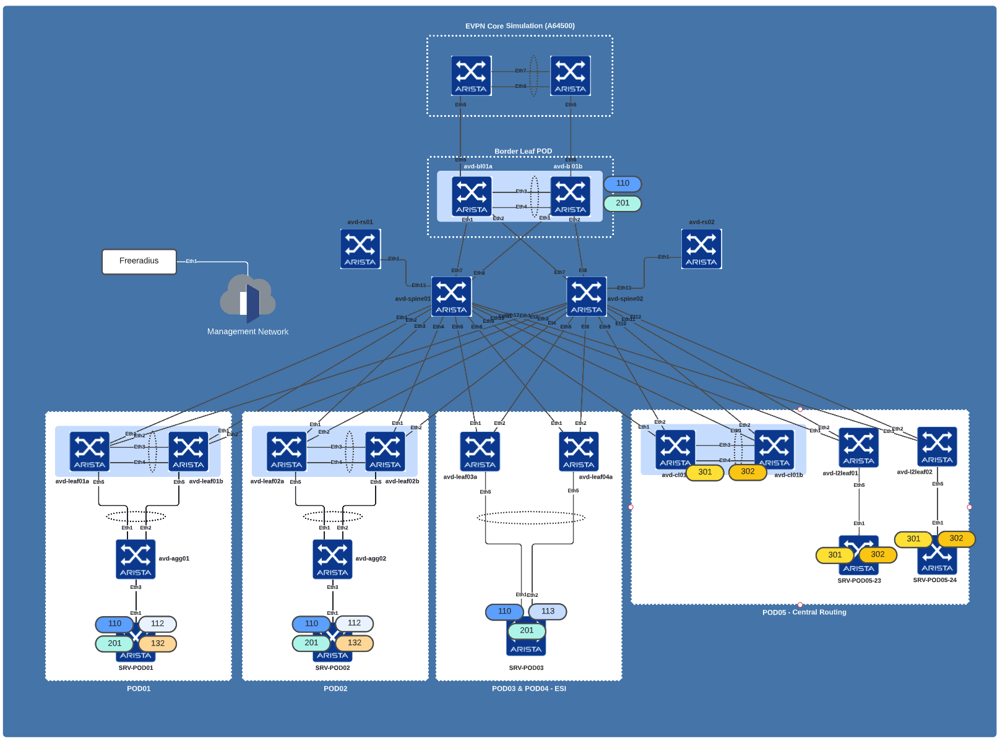

# Arista Validated Design Lab

- [Arista Validated Design Lab](#arista-validated-design-lab)
  - [Topology](#topology)
  - [Setup](#setup)
    - [Required tools:](#required-tools)
    - [Cloud deployment](#cloud-deployment)
  - [Inventory Information](#inventory-information)
    - [Inetsix eAPI Inventory](#inetsix-eapi-inventory)
  - [Make commands](#make-commands)
    - [Generic commands](#generic-commands)
    - [AVD Specifics](#avd-specifics)
    - [Containerlab Specifics](#containerlab-specifics)
    - [Ansible Execution Engine Specifics](#ansible-execution-engine-specifics)
    - [Misc commands](#misc-commands)
  - [Make Options](#make-options)
  - [Ansible Execution Engine](#ansible-execution-engine)
    - [Build Image](#build-image)
    - [Run Execution Engine](#run-execution-engine)

## Topology



## Setup

- Install required collections with `ansible-galaxy collection install --force -r collections.yml`
- Ansible playbook debugger activated in ansible.cfg
- Execution time configured
- Default inventory is set to [`inventories/inetsix-lab/`](inventories/inetsix-lab/inventory.yml)
- Playbooks are all saved under [playbooks](playbooks/)
- AVD outputs are generated under each `inventory`: directory

Inventory can be changed with following command:

```bash
$ make <command> INVENTORY=<your inventory>
```
### Required tools:

- Github CLI

### Cloud deployment

In case, you need to deploy VM in the cloud, you can check this terraform content: [__cloud-stacks/modules/aws-single-vm/vars.init.tf__](cloud-stacks/modules/aws-single-vm/vars.init.tf)

## Inventory Information

### Inetsix eAPI Inventory

- __Devices:__
  - Out of band network: 10.73.252.0/24
  - Username: ansible
  - Password: ansible

Available [here](inventories/inetsix-lab/README.md)

> A Jumphost and Iptables can be used in this inventory and must be configured prior any test.

## Make commands

### Generic commands

- `build             `:  Build AVD topology, tooling configuration and Containerlab topology
- `clean             `:  Cleanup local environment (AVD and Containerlab)
- `deploy            `:  Power UP containerlab topology
- `destroy           `:  Shutdown containerlab topology
- `push              `:  Alias to push configuration to default lab

### AVD Specifics

- `avd-build-complete`:  Run ansible playbook to build EVPN SCOPE configuration for generic EOS AVD topology and NO CV (No Documentation)
- `avd-build         `:  Run ansible playbook to build EVPN SCOPE configuration for generic EOS AVD topology and NO CV (No Documentation)
- `avd-clean         `:  Clenup Build environment
- `eos-backup        `:  Backup current running configuration
- `eos-snapshot      `:  Extract commands outputs
- `jump-push         `:  Run ansible playbook to push previsouly generated configurations via eAPI

### Containerlab Specifics

- `clab-build        `:  Build AVD configuration for EOS device in Fabric
- `clab-clean        `:  Cleanup Containerlab previous builds
- `clab-deploy       `:  Deploy containerlab topology
- `clab-destroy      `:  Destroy Containerlab topology
- `clab-push         `:  Run ansible playbook to push previsouly generated configurations via eAPI
- `clab-reload       `:  Destroy lab, build configuration and deploy lab.
- `mysocket-login    `:  Login Mysocket.io with Containerlab

### Ansible Execution Engine Specifics

- `ee-build-latest   `:  Build Ansible Execution Builder
- `ee-build          `:  Build Ansible Execution Builder
- `ee-runner         `:  Execute ansible EE runner in interactive mode

### Misc commands

- `help              `:  Display help message (*: main entry points / []: part of an entry point)
- `setup-development `:  Setup development environment
- `setup-galaxy      `:  Install arista collections using ansible galaxy
- `tooling-build     `:  Run ansible playbook to build EVPN SCOPE configuration for generic EOS AVD topology and NO CV (No Documentation)

## Make Options

```bash
### Generic Variables
SHELL := /bin/zsh
# Github CLI tool
GH_CLI := $(which gh)
### Ansible variables
# Inventory for EOS playbooks
INVENTORY ?= inventories/inetsix-lab
# Default Inventory file to look for
INVENTORY_FILE = inventory.yml
# VAULT file
VAULT_FILE ?= ~/bin/op-vault
# Name of the SCOPE to build. Used in --limit scope
SCOPE ?= avd,tooling
# For optional ansible options
ANSIBLE_ARGS ?= --skip-tags debug --diff
# Email to login with Mysocket.io
EMAIL ?=
# Topology file generated for containerlab
CLAB_TOPO ?= containerlabs.yml
# Network used by CLAB to expose containers
CLAB_NETWORK ?= mgmt-fabric
# EAPI NAT Host
JUMP ?= 10.73.1.27
# Ansible Execution builder
EE_FILE ?= ansible-ee-avd/execution-environment-default.yml
EE_IMAGE ?= titom73/ansible-ee-avd
EE_TAG ?= stable-2.12-devel
```

## Ansible Execution Engine

### Build Image

```bash
$ make ee-build
ansible-builder build --tag inetsix/ansible-ee-avd:2.11 --container-runtime docker\
 -f docker-images/ansible-ee-avd/execution-environment.yml \
 --build-arg EE_BASE_IMAGE=quay.io/ansible/\
 ansible-runner:stable-2.11-latest
Running command:
  docker build -f context/Dockerfile -t inetsix/ansible-ee-avd:2.11 \
  --build-arg=EE_BASE_IMAGE=quay.io/ansible/ansible-runner:stable-2.11-latest context
Complete! The build context can be found at: ./context
```

__Options__:

- `EE_IMAGE`: default is `inetsix/ansible-ee-avd`
- `EE_TAG`: default is `2.11` It is also the tag used for ansible version in base EE image

### Run Execution Engine

```bash
$ make ee-runner EE_CMD='ansible --version'

ansible [core 2.11.6.post0]
  config file = /runner/ansible.cfg
  configured module search path = ['/runner/ansible-avd/library']
  ansible python module location = /usr/local/lib/python3.8/site-packages/ansible
  ansible collection location = /ansible-inetsix:/ansible-cvp:/ansible-avd:\
    /home/runner/.ansible/collections:/usr/share/ansible/collections
  executable location = /usr/local/bin/ansible
  python version = 3.8.8 (default, Aug 25 2021, 16:13:02) \
    [GCC 8.5.0 20210514 (Red Hat 8.5.0-3)]
  jinja version = 3.0.3
  libyaml = True
```

__Options__:

- `EE_IMAGE`: default is `titom73/ansible-ee-avd`
- `EE_TAG`: default is `stable-2.12-devel` It is also the tag used for ansible version in base EE image
