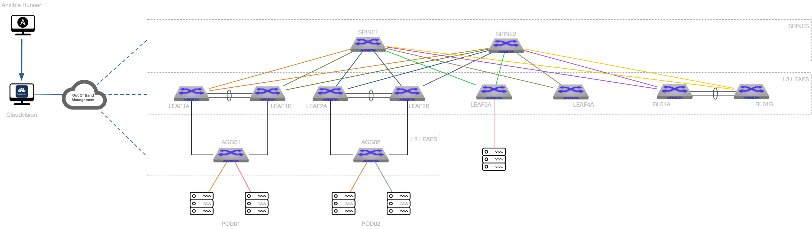

# Arista Validated Design Lab

- [Arista Validated Design Lab](#arista-validated-design-lab)
  - [Topology](#topology)
  - [Setup](#setup)
  - [Inventory Information](#inventory-information)
    - [EMEA Inventory](#emea-inventory)
    - [Inetsix CVP Inventory](#inetsix-cvp-inventory)
    - [Inetsix eAPI Inventory](#inetsix-eapi-inventory)
  - [Enable debugging](#enable-debugging)
    - [Cloudvision collection](#cloudvision-collection)
  - [AVD Commands and Playbooks](#avd-commands-and-playbooks)
    - [AVD Build](#avd-build)
      - [Build offline configuration with default underlay protocol (BGP)](#build-offline-configuration-with-default-underlay-protocol-bgp)
      - [Build offline configuration with ISIS as underlay protocol](#build-offline-configuration-with-isis-as-underlay-protocol)
      - [Run webserver for documentation](#run-webserver-for-documentation)
    - [Provision Cloudvision](#provision-cloudvision)
    - [Deploy AVD on Cloudvision](#deploy-avd-on-cloudvision)
      - [Deploy using default underlay protocol (BGP)](#deploy-using-default-underlay-protocol-bgp)
      - [Deploy using ISIS as underlay protocol](#deploy-using-isis-as-underlay-protocol)
    - [Reset lab to ZTP mode](#reset-lab-to-ztp-mode)
  - [Generic AVD Builder](#generic-avd-builder)
  - [AVD Configlet Uploader](#avd-configlet-uploader)
    - [Upload configlets](#upload-configlets)
    - [Delete configlets](#delete-configlets)
  - [Container Validation](#container-validation)
    - [Create container topology](#create-container-topology)
    - [Delete container topology](#delete-container-topology)
  - [Build ZTP Server](#build-ztp-server)
    - [Edit ZTP Information](#edit-ztp-information)
    - [Configure CV as ZTP](#configure-cv-as-ztp)
  - [Debugging Playbooks](#debugging-playbooks)
    - [Get CVP Facts](#get-cvp-facts)
    - [Get AVD variables](#get-avd-variables)
      - [EOS_L3LS_EVPN vars](#eosl3lsevpn-vars)
      - [EOS_CLI_CONFIG_GEN vars](#eoscliconfiggen-vars)
    - [Docker Environement](#docker-environement)
      - [Build Docker image](#build-docker-image)
      - [Run Docker container](#run-docker-container)
    - [Expose eAPI port with Jumphost](#expose-eapi-port-with-jumphost)

## Topology



## Setup

- [`ansible-cvp`](https://github.com/aristanetworks/ansible-cvp): configured under ../ansible-cvp
- [`ansible-avd`](https://github.com/aristanetworks/ansible-avd): configured under ../ansible-avd
- Ansible playbook debugger activated in ansible.cfg
- Execution time configured
- Default inventory is set to [`inventories/inetsix/`](inventories/inetsix/inventory.yml)
- Playbooks are all saved under [playbooks](playbooks/)
- AVD outputs are generated under [playbooks](${INVENTORY}/)

> Inventory can be changed with following command: `make INVENTORY=<your inventory> ...`

## Inventory Information

### EMEA Inventory

- __Cloudvision__
  - IP: 10.83.28.164
  - Username: ansible
  - Password: ansible

- __Devices:__
  - Out of band network: 10.255.0.0/24
  - Username: ansible
  - Password: ansible

### Inetsix CVP Inventory

- __Cloudvision__
  - IP: 10.73.1.239
  - Username: ansible
  - Password: ansible

- __Devices:__
  - Out of band network: 10.73.255.0/24
  - Username: ansible
  - Password: ansible

Available [here](inventories/inetsix-cvp/README.md)

### Inetsix eAPI Inventory

- __Devices:__
  - Out of band network: 10.73.254.0/24
  - Username: ansible
  - Password: ansible

Available [here](inventories/inetsix-eapi/README.md)

Jumphost and Iptables are used in this inventory and must be configured prior any test.

## Enable debugging

### Cloudvision collection

```shell
$ source activate-arista.cvp-logs.env

export ANSIBLE_CVP_LOG_FILE=cvp-debug-logs/arista.cvp.debug.log
export ANSIBLE_CVP_LOG_LEVEL=debug
export ANSIBLE_CVP_LOG_APICALL=warning
```

Log folder: `cvp-debug-logs/`

## AVD Commands and Playbooks

### AVD Build

#### Build offline configuration with default underlay protocol (BGP)

```shell
# Makefile
$ make avd-build

# Ansible command
$ ansible-playbook playbooks/dc1-fabric-deploy-cvp.yml --tags build
```

#### Build offline configuration with ISIS as underlay protocol

```shell
# Makefile
$ make avd-build-isis

# Ansible command
$ ansible-playbook playbooks/dc1-fabric-deploy-cvp.yml \
    --tags build \
    --extra-vars "underlay_routing_protocol=ISIS"
```

#### Run webserver for documentation

> mkdocs MUST be installed using [`requirements.txt`](requirements.txt)

```shell
$ mkdocs serve
INFO    -  Building documentation...
INFO    -  Cleaning site directory
INFO    -  Documentation built in 0.51 seconds
[I 200520 09:45:42 server:296] Serving on http://127.0.0.1:8000
INFO    -  Serving on http://127.0.0.1:8000
...
```

Documentation available on [localhost](http://127.0.0.1:8000/DC1_FABRIC/DC1_FABRIC/)

### Provision Cloudvision

In this scenario, playbook do not execute pending tasks

```shell
# Makefile
$ make avd-provision

# Ansible command
$ ansible-playbook playbooks/dc1-fabric-deploy-cvp.yml --tags provision
```

### Deploy AVD on Cloudvision

Run following steps:
- build
- provision

Set var to execute pending tasks

#### Deploy using default underlay protocol (BGP)

```shell
# Makefile
$ make avd-deploy

# Ansible command
$ ansible-playbook playbooks/dc1-fabric-deploy-cvp.yml \
    --extra-vars "execute_tasks=true" \
    --tags "build,provision,apply"
```

#### Deploy using ISIS as underlay protocol

```shell
# Makefile
$ make avd-deploy-isis

# Ansible command
$ ansible-playbook playbooks/dc1-fabric-deploy-cvp.yml \
    --extra-vars "execute_tasks=true underlay_routing_protocol=ISIS" \
    --tags "build,provision,apply"
```

### Reset lab to ZTP mode

```shell
# Makefile
$ make avd-reset

# Ansible command
$ ansible-playbook playbooks/dc1-fabric-reset-cvp.yml
```

## Generic AVD Builder

To build configuration offline with a generic topology and no Cloudvision instance, use following Make:

```shell
# Makefile
$ make generic-build INVENTORY=inventories/inetsix-eapi

# Ansible command
$ ansible-playbook playbooks/avd-generic-build.yml --tags build -i inventories/inetsix-eapi/inventory.yml
```

If there is no routed access, use [iptables approach](#expose-eapi-port-with-jumphost)

## AVD Configlet Uploader

### Upload configlets

- Source folder: `configlets`

```shell
# Makefile
$ make configlet-upload

# Ansible command
$ ansible-playbook playbooks/dc1-upload-configlets.yml
```

### Delete configlets

- Source folder: `configlets`

```shell
# Makefile
$ make configlet-delete

# Ansible command
$ ansible-playbook playbooks/dc1-remove-configlets.yml
```

## Container Validation

### Create container topology

```shell
# Makefile
$ make container-create

# Ansible command
$ ansible-playbook playbooks/cv-container-testing.yml --extra-vars "run_mode=merge"
```

### Delete container topology

```shell
# Makefile
$ make container-delete

# Ansible command
$ ansible-playbook playbooks/cv-container-testing.yml --extra-vars "run_mode=delete"
```

## Build ZTP Server

### Edit ZTP Information

> Only if DHCP service is running on Cloudvision. If not, please refer to [lab provisioning repository](https://github.com/titom73/lab-provisionning)

```yaml
# vim $(INVENTORY)/group_vars/CVP.yml
---
ztp:
  default:
    registration: 'http://10.255.0.1/ztp/bootstrap'
    gateway: 10.255.0.3
    nameservers:
      - '10.255.0.3'
  general:
    subnets:
      - network: 10.255.0.0
        netmask: 255.255.255.0
        gateway: 10.255.0.3
        nameservers:
          - '10.255.0.3'
        start: 10.255.0.200
        end: 10.255.0.250
        lease_time: 300
  clients:
  # AVD/CVP Integration
    - name: DC1-SPINE1
      mac: 0c:1d:c0:1d:62:01
      ip4: 10.255.0.11
```

### Configure CV as ZTP

```shell
# Makefile
$ make dhcp-configure

# Ansible command
$ ansible-playbook playbooks/dc1-ztp-configuration.yml
```

## Debugging Playbooks

### Get CVP Facts

```shell
# Makefile
$ make facts

# Ansible command
$ ansible-playbook playbooks/extract-facts.yml \
    --extra-vars "output_file=../cvp-debug-logs/arista.cvp.facts.json"
```

### Get AVD variables

#### EOS_L3LS_EVPN vars

- Output folders: [`output_variables`](output_variables/)

```shell
# Makefile
$ make avd-vars-input

# Ansible command
$ ansible-playbook playbooks/extract-avd-vars.yml --tags eos_l3ls_evpn
```

#### EOS_CLI_CONFIG_GEN vars

- Output folders: [`output_variables`](output_variables/)

```shell
# Makefile
$ make avd-vars-devices

# Ansible command
$ ansible-playbook playbooks/extract-avd-vars.yml --tags cli
```

### Docker Environement

#### Build Docker image

> Require to clone ansible-avd next to this repository

```shell
# Makefile
$ make docker-build

# Docker command
$ docker build -f ../ansible-avd/development/Dockerfile -t avdteam/lab:latest ../ansible-avd/development/
```

#### Run Docker container

```shell
# Makefile
$ make docker-run

# Docker command
$ docker run -it --rm -v ~/arista-ansible/lab-validation/../:/projects avdteam/lab:latest /bin/zsh
```

### Expose eAPI port with Jumphost

In case of no routed access, use [iptables](./iptables-port-forward.sh) to expose eAPI ports:

```shell
# On Jumphost

# Edit Addresses
$ vim iptables-port-forward.sh

iptables -t nat -A PREROUTING -p tcp -i eth0 --dport 8022 -j DNAT --to-destination 10.73.254.22:443
iptables -A FORWARD -p tcp -d 10.73.254.0/24 --dport 443 -m state --state NEW,ESTABLISHED,RELATED -j ACCEPT

$ sudo sh iptables-port-forward.sh
```