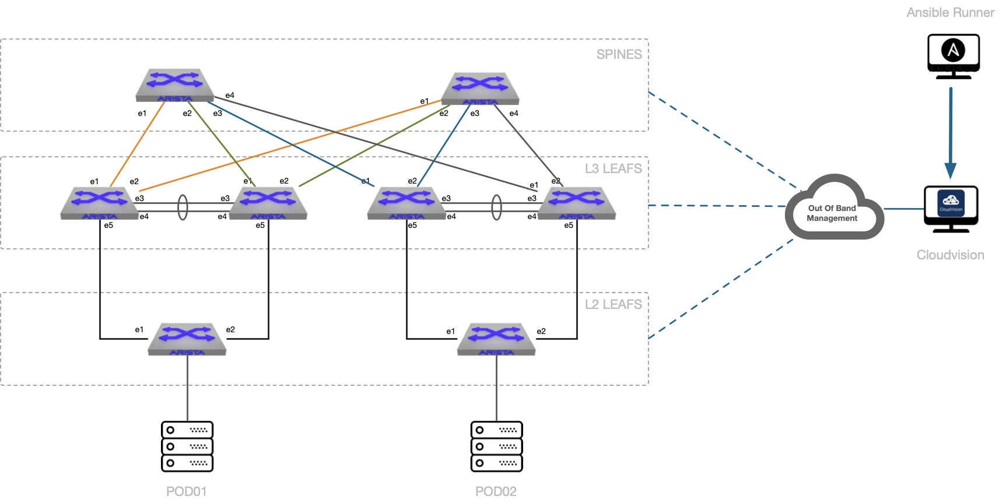

# AVD Lab validation

- [AVD Lab validation](#avd-lab-validation)
  - [Topology](#topology)
  - [Setup](#setup)
  - [AVD Commands and Playbooks](#avd-commands-and-playbooks)
    - [AVD Build](#avd-build)
      - [Build offline configuration with default underlay protocol (BGP)](#build-offline-configuration-with-default-underlay-protocol-bgp)
      - [Build offline configuration with ISIS as underlay protocol](#build-offline-configuration-with-isis-as-underlay-protocol)
    - [Provision Cloudvision](#provision-cloudvision)
    - [Deploy AVD on Cloudvision](#deploy-avd-on-cloudvision)
      - [Deploy using default underlay protocol (BGP)](#deploy-using-default-underlay-protocol-bgp)
      - [Deploy using ISIS as underlay protocol](#deploy-using-isis-as-underlay-protocol)
    - [Reset lab to ZTP mode](#reset-lab-to-ztp-mode)
  - [AVD Configlet Uploader](#avd-configlet-uploader)
    - [Upload configlets](#upload-configlets)
    - [Delete configlets](#delete-configlets)
  - [Debug Playbooks](#debug-playbooks)
    - [Get variables](#get-variables)
      - [EOS_L3LS_EVPN vars](#eosl3lsevpn-vars)
      - [EOS_CLI_CONFIG_GEN vars](#eoscliconfiggen-vars)

## Topology



## Setup

- `ansible-cvp`: configured under ../ansible-cvp
- `ansible-avd`: configured under ../ansible-avd
- Ansible playbook debugger activated in ansible.cfg
- Execution time configured

## AVD Commands and Playbooks

### AVD Build

#### Build offline configuration with default underlay protocol (BGP)

```shell
# Makefile
$ make avd-build

# Ansible command
$ ansible-playbook dc1-fabric-deploy-cvp.yml --tags build
```

#### Build offline configuration with ISIS as underlay protocol

```shell
# Makefile
$ make avd-build-isis

# Ansible command
$ ansible-playbook dc1-fabric-deploy-cvp.yml --tags build --extra-vars "underlay_routing_protocol=ISIS"
```

### Provision Cloudvision

In this scenario, playbook do not execute pending tasks

```shell
# Makefile
$ make avd-provision

# Ansible command
$ ansible-playbook dc1-fabric-deploy-cvp.yml --tags provision
```

### Deploy AVD on Cloudvision

Run following steps:
- build
- provision

Set var to execute pending tasks

#### Deploy using default underlay protocol (BGP)

```shell
# Makefile
$ make avd-deploy

# Ansible command
$ ansible-playbook dc1-fabric-deploy-cvp.yml \
    --extra-vars "execute_tasks=true" \
    --tags "build,provision,apply"
```

#### Deploy using ISIS as underlay protocol

```shell
# Makefile
$ make avd-deploy-isis

# Ansible command
$ ansible-playbook dc1-fabric-deploy-cvp.yml \
    --extra-vars "execute_tasks=true underlay_routing_protocol=ISIS" \
    --tags "build,provision,apply"
```

### Reset lab to ZTP mode

```shell
# Makefile
$ make avd-reset

# Ansible command
$ ansible-playbook dc1-fabric-reset-cvp.yml
```

## AVD Configlet Uploader

### Upload configlets

- Source folder: `configlets`

```shell
# Makefile
$ make configlet-upload

# Ansible command
$ ansible-playbook dc1-upload-configlets.yml
```

### Delete configlets

- Source folder: `configlets`

```shell
# Makefile
$ make configlet-delete

# Ansible command
$ ansible-playbook dc1-remove-configlets.yml
```

## Debug Playbooks

### Get variables

#### EOS_L3LS_EVPN vars

```shell
# Makefile
$ make avd-vars-input

# Ansible command
$ ansible-playbook extract-avd-vars.yml --tags eos_l3ls_evpn
```

#### EOS_CLI_CONFIG_GEN vars

```shell
# Makefile
$ make avd-vars-devices

# Ansible command
$ ansible-playbook extract-avd-vars.yml --tags cli
```
