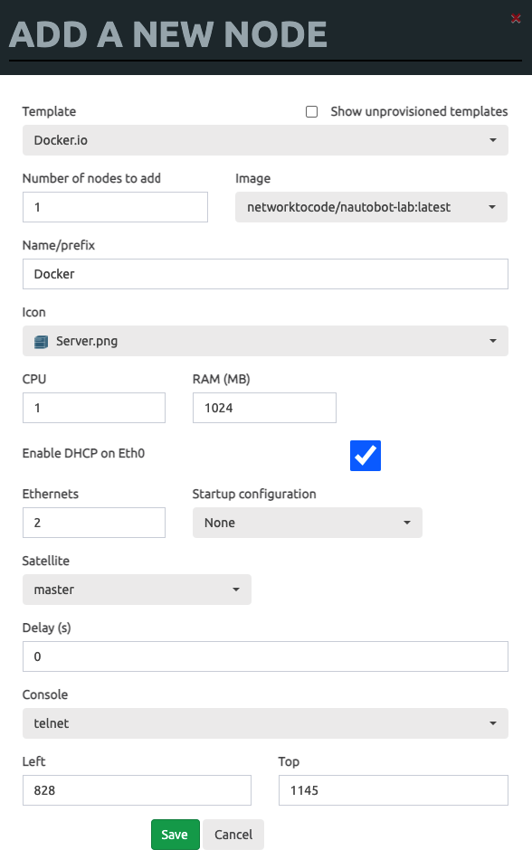
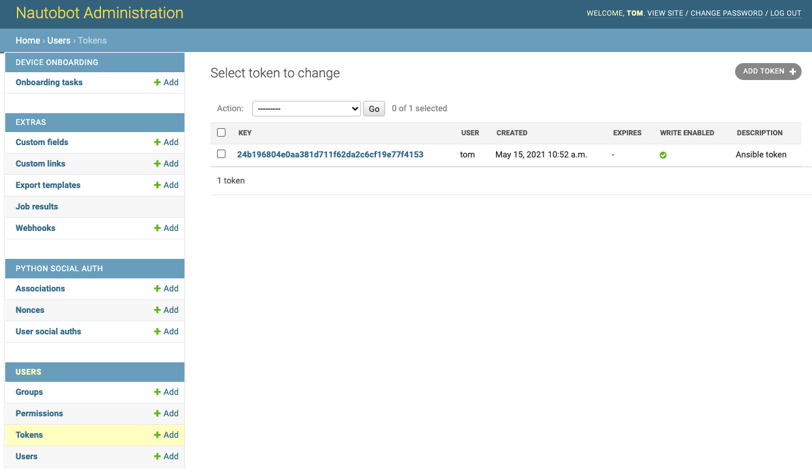
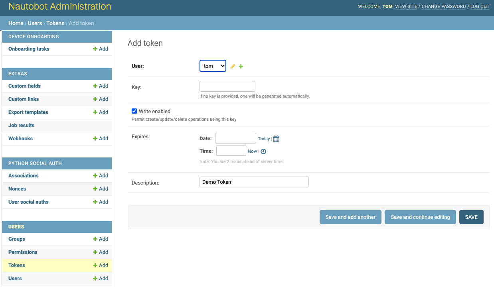
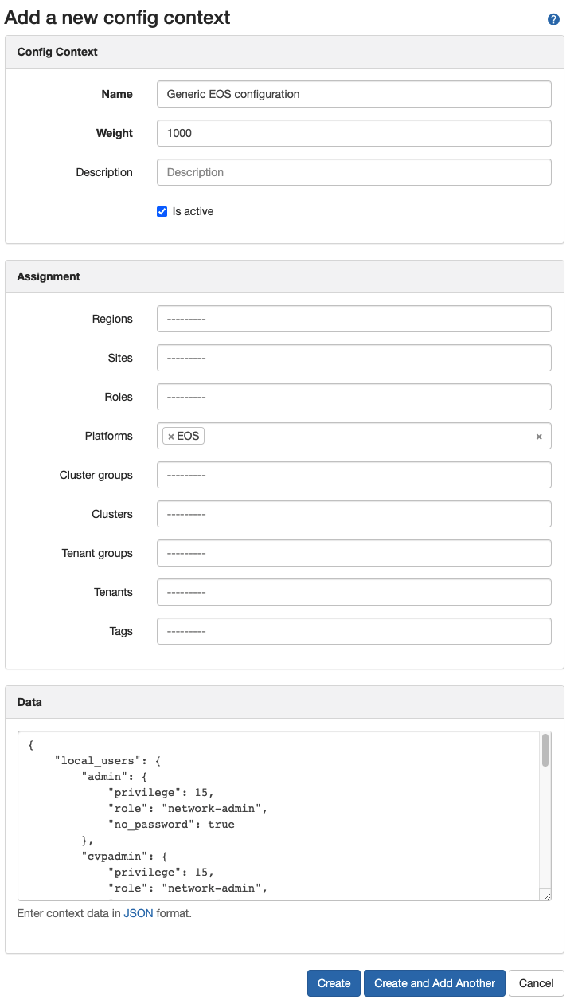

# Integrate Nautobot with AVD


## Overview


## Docker lab setup

### EVE-NG integration

- Install Nautobot image

```bash
$ dc pull networktocode/nautobot-lab

$ dc images
REPOSITORY                   TAG                 IMAGE ID            CREATED             SIZE
networktocode/nautobot-lab   latest              0ff772651e93        8 days ago          1.04GB
titom73/labclient            latest              c01406f62e88        2 months ago        41.9MB
avdteam/vscode               latest              3ab2214df0cf        4 months ago        3.19GB
registry                     2                   678dfa38fcfa        4 months ago        26.2MB
eve-desktop                  latest              ca1333621bd7        10 months ago       3.65GB
eve-gui-server               latest              9db19c879a17        10 months ago       3.84GB
eve-chrome                   latest              8e7f4c9a04b2        12 months ago       2.17GB
eve-firefox                  latest              0266d108a1bb        12 months ago       2.12GB
eve-wireshark                latest              82a009773e89        12 months ago       1.56GB
dockergui-rdp                latest              be03f3b46439        17 months ago       1.29GB
```

- Add nautobot node in your topology



In this setup, nautobot instance will be configured with 2 interfaces connected as:

- `eth0`: connected to user lan to access webinterface
- `eth1`: connected to Arista OOB network to access devices.

### Configure nautobot system

- Configure network interfaces

```bash
$ dc ps
root@eve-ng:~# dc ps
CONTAINER ID        IMAGE                      COMMAND                  CREATED             STATUS                 PORTS               NAMES
d9b6e9821d32        networktocode/nautobot-lab "/usr/local/bin/supe…"   5 hours ago         Up 4 hours (healthy)                       69ccb9e4-cb56-4ca2-b327-e3f2b1ef5b1f-1-16

$ dc exec -it d9b6e9821d32 apt update
$ dc exec -it d9b6e9821d32 apt install net-tools vim
$ dc exec -it d9b6e9821d32 ifconfig eth1 10.73.255.253/24
```

- create super user to connect using webinterface

```bash
$ exec -it d9b6e9821d32 nautobot-server createsuperuser
```

- Install onboarding plugin

```bash
$ dc exec -it d9b6e9821d32 bash

$ pip3 install nautobot-device-onboarding

$ vim nautobot_config.py
```

And update configuration related to plugins

```python
PLUGINS = ["nautobot_device_onboarding"]
```

- Configure NAPALM for authentication

```bash
$ vim nautobot_config.py
```

And update configuration related to NAPALM

```python
# Credentials that Nautobot will uses to authenticate to devices when connecting via NAPALM.
NAPALM_USERNAME = "<your username>"
NAPALM_PASSWORD = "<your password>"
```

> __Restart container using EVE-NG interface__

## Onboard devices

It requires additional setup to create following elements first:

- Site: __AVD eAPI Lab__ with slug `avd-eapi-lab`
- Manufacturer: __Arista__
- Platform: __EOS__ with slug `eos`
- Device Types: __vEOS__ with slug `veos`
- Device roles: __L3Leaf__ and __Spine__ with slugs `l3leaf` and `spine`

Go to __Plugins / Onboarding Tasks__ and use following element for import

```csv
site,ip_address,port,platform,role,username,password,device_type
avd-eapi-lab,10.73.254.11,443,eos,l3leaf,ansible,ansible,veos
avd-eapi-lab,10.73.254.12,443,eos,l3leaf,ansible,ansible,veos
avd-eapi-lab,10.73.254.13,443,eos,l3leaf,ansible,ansible,veos
avd-eapi-lab,10.73.254.14,443,eos,l3leaf,ansible,ansible,veos
avd-eapi-lab,10.73.254.15,443,eos,l3leaf,ansible,ansible,veos
avd-eapi-lab,10.73.254.16,443,eos,l3leaf,ansible,ansible,veos
avd-eapi-lab,10.73.254.17,443,eos,l3leaf,ansible,ansible,veos
avd-eapi-lab,10.73.254.18,443,eos,l3leaf,ansible,ansible,veos
avd-eapi-lab,10.73.254.1,443,eos,spine,ansible,ansible,veos
avd-eapi-lab,10.73.254.2,443,eos,spine,ansible,ansible,veos
```

## Ansible integration

- [Documentation](https://netbox-ansible-collection.readthedocs.io/en/latest/plugins/nb_inventory_inventory.html#ansible-collections-netbox-netbox-nb-inventory-inventory)
- [Repository](https://github.com/nautobot/nautobot-ansible)

### Install collection

```bash
$ pip install pynautobot

$ ansible-galaxy collection install networktocode.nautobot
```

### Use Nautobot dynamic inventory

- Get Nautobot token



Generate a new token



- Inventory file

```yaml
plugin: networktocode.nautobot.inventory
api_endpoint: http://10.73.1.17:8000
validate_certs: False
config_context: False
token: <your token here>
group_by:
  - device_roles
# query_filters:
#   - role: network-edge-router
device_query_filters:
  - has_primary_ip: 'true'

interfaces: True
```

### Get data from Nautobot

```shell
$ ansible-inventory -i inventories/nautobot/inventory.yml --list
```

Output is the following:

```json
{
    "_meta": {
        "hostvars": {
            "EAPI-BL01A": {
                "ansible_host": "10.73.254.15",
                "custom_fields": {},
                "device_roles": [
                    "l3leaf"
                ],
                "device_types": [
                    "veos"
                ],
                "interfaces": [
                    {
                        "cable": {
                            "display": "#a0f17f93-c5b6-41f0-8224-34cbf449f8e6",
                            "id": "a0f17f93-c5b6-41f0-8224-34cbf449f8e6",
                            "label": "",
                            "url": "http://10.73.1.17:8000/api/dcim/cables/a0f17f93-c5b6-41f0-8224-34cbf449f8e6/"
                        },
                        "cable_peer": {
                            "cable": "a0f17f93-c5b6-41f0-8224-34cbf449f8e6",
                            "device": {
                                "display": "EAPI-SPINE1",
                                "id": "02f6dfe9-8a9e-4f67-b196-5d7fd2497d2f",
                                "name": "EAPI-SPINE1",
                                "url": "http://10.73.1.17:8000/api/dcim/devices/02f6dfe9-8a9e-4f67-b196-5d7fd2497d2f/"
                            },
                            "display": "Ethernet5",
                            "id": "e374430a-c416-4be5-9b60-0a02c26179fa",
                            "name": "Ethernet5",
                            "url": "http://10.73.1.17:8000/api/dcim/interfaces/e374430a-c416-4be5-9b60-0a02c26179fa/"
                        },
                        "cable_peer_type": "dcim.interface",
                        "connected_endpoint": {
                            "cable": "a0f17f93-c5b6-41f0-8224-34cbf449f8e6",
                            "device": {
                                "display": "EAPI-SPINE1",
                                "id": "02f6dfe9-8a9e-4f67-b196-5d7fd2497d2f",
                                "name": "EAPI-SPINE1",
                                "url": "http://10.73.1.17:8000/api/dcim/devices/02f6dfe9-8a9e-4f67-b196-5d7fd2497d2f/"
                            },
                            "display": "Ethernet5",
                            "id": "e374430a-c416-4be5-9b60-0a02c26179fa",
                            "name": "Ethernet5",
                            "url": "http://10.73.1.17:8000/api/dcim/interfaces/e374430a-c416-4be5-9b60-0a02c26179fa/"
                        },
                        "connected_endpoint_reachable": true,
                        "connected_endpoint_type": "dcim.interface",
                        "count_ipaddresses": 0,
                        "custom_fields": {},
                        "description": "",
                        "device": {
                            "display": "EAPI-BL01A",
                            "id": "f63be1eb-4e67-4962-bbdc-0e9c8c823159",
                            "name": "EAPI-BL01A",
                            "url": "http://10.73.1.17:8000/api/dcim/devices/f63be1eb-4e67-4962-bbdc-0e9c8c823159/"
                        },
                        "display": "Ethernet1",
                        "enabled": true,
                        "id": "ddda2a2b-7e6a-4561-b14d-d5fd8be3b208",
                        "ip_addresses": [],
                        "label": "",
                        "lag": null,
                        "mac_address": null,
                        "mgmt_only": false,
                        "mode": null,
                        "mtu": null,
                        "name": "Ethernet1",
                        "tagged_vlans": [],
                        "tags": [],
                        "type": {
                            "label": "QSFP28 (100GE)",
                            "value": "100gbase-x-qsfp28"
                        },
                        "untagged_vlan": null,
                        "url": "http://10.73.1.17:8000/api/dcim/interfaces/ddda2a2b-7e6a-4561-b14d-d5fd8be3b208/"
                    },

    //... code ommitted ...

    "all": {
        "children": [
            "device_roles_l3leaf",
            "device_roles_spine",
            "ungrouped"
        ]
    },
    "device_roles_l3leaf": {
        "hosts": [
            "EAPI-BL01A",
            "EAPI-BL01B",
            "EAPI-LEAF1A",
            "EAPI-LEAF1B",
            "EAPI-LEAF2A",
            "EAPI-LEAF2B",
            "EAPI-LEAF3A",
            "EAPI-LEAF4A"
        ]
    },
    "device_roles_spine": {
        "hosts": [
            "EAPI-SPINE1",
            "EAPI-SPINE2"
        ]
    }
}
```

### Add additional data to devices

Go to __Extensibility / config-contexts__ section



> Note: it can also be a git repository where all of them are saved.

- Update nautobot dynamic inventory YAML file:

```yaml
plugin: networktocode.nautobot.inventory
api_endpoint: http://10.73.1.17:8000
validate_certs: False
token: < your token code >
group_by:
  - device_roles
# query_filters:
#   - role: network-edge-router
device_query_filters:
  - has_primary_ip: 'true'

config_context: True

interfaces: True
```

- Re run your ansible inventory

```json
{
    "_meta": {
        "hostvars": {
            "EAPI-BL01A": {
                "ansible_host": "10.73.254.15",
                "config_context": [
                    {
                        "cvp_ingestauth_key": "",
                        "cvp_instance_ips": [
                            "10.73.254.1"
                        ],
                        "local_users": {
                            "admin": {
                                "no_password": true,
                                "privilege": 15,
                                "role": "network-admin"
                            },
                            "ansible": {
                                "privilege": 15,
                                "role": "network-admin",
                                "sha512_password": "$6$Dzu11L7yp9j3nCM9$FSptxMPyIL555OMO.ldnjDXgwZmrfMYwHSr0uznE5Qoqvd9a6UdjiFcJUhGLtvXVZR1r.A/iF5aAt50hf/EK4/"
                            },
                            "cvpadmin": {
                                "privilege": 15,
                                "role": "network-admin",
                                "sha512_password": "$6$rZKcbIZ7iWGAWTUM$TCgDn1KcavS0s.OV8lacMTUkxTByfzcGlFlYUWroxYuU7M/9bIodhRO7nXGzMweUxvbk8mJmQl8Bh44cRktUj."
                            },
                            "demo": {
                                "privilege": 15,
                                "role": "network-admin",
                                "sha512_password": "$6$Dzu11L7yp9j3nCM9$FSptxMPyIL555OMO.ldnjDXgwZmrfMYwHSr0uznE5Qoqvd9a6UdjiFcJUhGLtvXVZR1r.A/iF5aAt50hf/EK4/"
                            }
                        },
                        "mgmt_gateway": "10.73.254.253",
                        "name_servers": [
                            "10.73.254.253",
                            "10.73.1.254"
                        ],
                        "ntp_servers": [
                            "10.73.254.253",
                            "10.73.1.254"
                        ],
                        "timezone": "Europe/Paris"
                    }
                ],
                "custom_fields": {},
                "device_roles": [
                    "l3leaf"
                ],
                "device_types": [
                    "veos"
                ],
                "is_virtual": false,
                "local_context_data": [
                    null
                ],
                "manufacturers": [
                    "arista"
                ],
                "platforms": [
                    "eos"
                ],
                "primary_ip4": "10.73.254.15",
                "regions": [],
                "services": [],
                "sites": [
                    "avd-eapi-lab"
                ],
                "status": {
                    "label": "Active",
                    "value": "active"
                },
                "tags": []
            },
... code ommitted ...
```

#### config-context flattern

Using flattern_config_context will directly include these elements right under device name:

- Configuration

```yaml
config_context: true
flatten_config_context: True
```

- Result

```json
{
    "_meta": {
        "hostvars": {
            "EAPI-BL01A": {
                "ansible_host": "10.73.254.15",
                "custom_fields": {},
                "cvp_ingestauth_key": "",
                "cvp_instance_ips": [
                    "10.73.254.1"
                ],
                "device_roles": [
                    "l3leaf"
                ],
                "device_types": [
                    "veos"
                ],
                "is_virtual": false,
                "local_context_data": [
                    null
                ],
                "local_users": {
                    "admin": {
                        "no_password": true,
                        "privilege": 15,
                        "role": "network-admin"
                    },
                    "ansible": {
                        "privilege": 15,
                        "role": "network-admin",
                        "sha512_password": "$6$Dzu11L7yp9j3nCM9$FSptxMPyIL555OMO.ldnjDXgwZmrfMYwHSr0uznE5Qoqvd9a6UdjiFcJUhGLtvXVZR1r.A/iF5aAt50hf/EK4/"
                    },
                    "cvpadmin": {
                        "privilege": 15,
                        "role": "network-admin",
                        "sha512_password": "$6$rZKcbIZ7iWGAWTUM$TCgDn1KcavS0s.OV8lacMTUkxTByfzcGlFlYUWroxYuU7M/9bIodhRO7nXGzMweUxvbk8mJmQl8Bh44cRktUj."
                    },
                    "demo": {
                        "privilege": 15,
                        "role": "network-admin",
                        "sha512_password": "$6$Dzu11L7yp9j3nCM9$FSptxMPyIL555OMO.ldnjDXgwZmrfMYwHSr0uznE5Qoqvd9a6UdjiFcJUhGLtvXVZR1r.A/iF5aAt50hf/EK4/"
                    }
                },
                "manufacturers": [
                    "arista"
                ],
                "mgmt_gateway": "10.73.254.253",
                "name_servers": [
                    "10.73.254.253",
                    "10.73.1.254"
                ],
                "ntp_servers": [
                    "10.73.254.253",
                    "10.73.1.254"
                ],
                "platforms": [
                    "eos"
                ],
                "primary_ip4": "10.73.254.15",
                "regions": [],
                "services": [],
                "sites": [
                    "avd-eapi-lab"
                ],
                "status": {
                    "label": "Active",
                    "value": "active"
                },
                "tags": [],
                "timezone": "Europe/Paris"
            },
... code ommitted ...
```