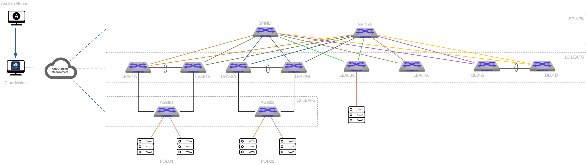

# Home Lab



## Information

### Authentication

  - Username: ansible
  - Password: ansible

### Topology Information

#### Subnet allocation

- Underlay:  172.31.255.0/24
- Loopback EVPN Control Plane: 192.168.255.0/24
- Loopback for VTEP: 192.168.254.0/24
- MLAG Subnet: 10.255.251.0/24
- MLAG Peer: 10.255.252.0/24

#### Tenants definition

- __Tenant A__
  - _Project 01_
    - PR01-DMZ --> vlan `110` / `10.1.10.0/24`
    - PR01-TRUST --> vlan `111` / `10.1.11.0/24`
  - _Project 02_
    - PR02-DMZ --> vlan `112` / `10.1.12.0/24`
- __Tenant B__
  - _Pure L2VLAN_
    - B-ELAN-201 --> vlan `201` / `10.2.1.0/24`

### Inventory overview

```yaml
CVP:
    hosts:
    cv_ztp:     # SSH Access
    cv_server:  # Rest API Access

# DC1_Fabric - EVPN Fabric running in home lab
DC1:
  children:
    DC1_FABRIC:
      children:
        DC1_SPINES:
          hosts:
            DC1-SPINE1:
                ansible_host: 10.73.255.101
            DC1-SPINE2:
                ansible_host: 10.73.255.102
        DC1_L3LEAFS:
          children:
            DC1_LEAF1:
              hosts:
                DC1-LEAF1A:
                    ansible_host: 10.73.255.111
                DC1-LEAF1B:
                    ansible_host: 10.73.255.112
            DC1_LEAF2:
              hosts:
                DC1-LEAF2A:
                  ansible_host: 10.73.255.113
                DC1-LEAF2B:
                  ansible_host: 10.73.255.114
            DC1_BL01:
              hosts:
                DC1-BL01A:
                  ansible_host: 10.73.255.115
                DC1-BL01B:
                  ansible_host: 10.73.255.116
        DC1_L2LEAFS:
          children:
            DC1_L2LEAF1:
              hosts:
                DC1-AGG01:
                  ansible_host: 10.73.255.121
            DC1_L2LEAF2:
              hosts:
                DC1-AGG02:
                  ansible_host: 10.73.255.122
    DC1_TENANTS_NETWORKS:
      children:
        DC1_L3LEAFS:
        DC1_L2LEAFS:
    DC1_SERVERS:
      children:
        DC1_L3LEAFS:
        DC1_L2LEAFS:
```
