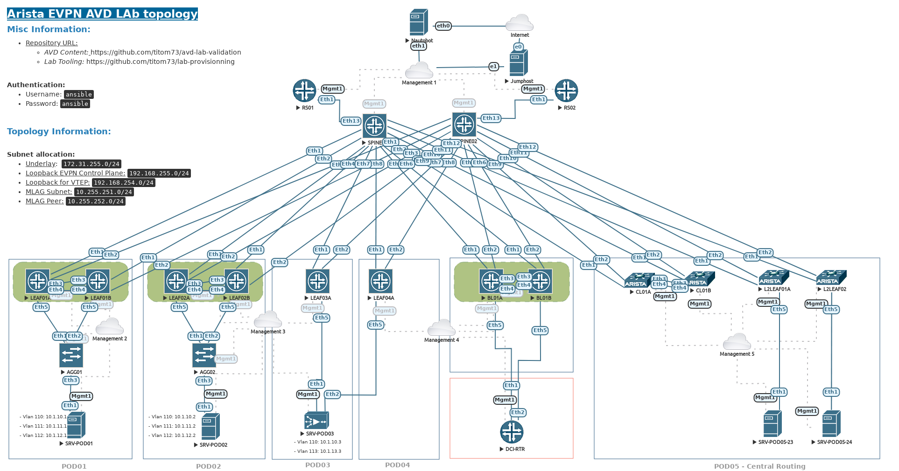

# AVD with eAPI deployment

## Information

- [EVE NG Topology](medias/eve-topology.zip)

### Authentication:
  - Username: ansible
  - Password: ansible

### Topology Information

### Network

| POD | Type | Node | Management IP | Platform | Provisioned in CloudVision |
| --- | ---- | ---- | ------------- | -------- | -------------------------- |
| EAPI_FABRIC | edge | EAPI-AGG01 | 10.73.254.21/24 |vEOS-LAB| Provisioned |
| EAPI_FABRIC | edge | EAPI-AGG02 | 10.73.254.22/24 |vEOS-LAB| Provisioned |
| EAPI_FABRIC | l2leaf | EAPI-L2LEAF01 | 10.73.254.31/24 |vEOS-LAB| Provisioned |
| EAPI_FABRIC | l2leaf | EAPI-L2LEAF02 | 10.73.254.32/24 |vEOS-LAB| Provisioned |
| EAPI_FABRIC | l3leaf | EAPI-BL01A | 10.73.254.15/24 |vEOS-LAB| Provisioned |
| EAPI_FABRIC | l3leaf | EAPI-BL01B | 10.73.254.16/24 |vEOS-LAB| Provisioned |
| EAPI_FABRIC | l3leaf | EAPI-CL01A | 10.73.254.19/24 |vEOS-LAB| Provisioned |
| EAPI_FABRIC | l3leaf | EAPI-CL01B | 10.73.254.20/24 |vEOS-LAB| Provisioned |
| EAPI_FABRIC | l3leaf | EAPI-LEAF1A | 10.73.254.11/24 |vEOS-LAB| Provisioned |
| EAPI_FABRIC | l3leaf | EAPI-LEAF1B | 10.73.254.12/24 |vEOS-LAB| Provisioned |
| EAPI_FABRIC | l3leaf | EAPI-LEAF2A | 10.73.254.13/24 |vEOS-LAB| Provisioned |
| EAPI_FABRIC | l3leaf | EAPI-LEAF2B | 10.73.254.14/24 |vEOS-LAB| Provisioned |
| EAPI_FABRIC | l3leaf | EAPI-LEAF3A | 10.73.254.17/24 |vEOS-LAB| Provisioned |
| EAPI_FABRIC | l3leaf | EAPI-LEAF4A | 10.73.254.18/24 |vEOS-LAB| Provisioned |
| EAPI_FABRIC | spine | EAPI-SPINE1 | 10.73.254.1/24 | vEOS-LAB | Provisioned |
| EAPI_FABRIC | spine | EAPI-SPINE2 | 10.73.254.2/24 | vEOS-LAB | Provisioned |

### Servers

| POD | Type | Node | Management IP | Platform | Provisioned in CloudVision |
| --- | ---- | ---- | ------------- | -------- | -------------------------- |
| EAPI_FABRIC | EOS | SRV-POD01    | 10.73.254.41/24 |vEOS-LAB| Provisioned |
| EAPI_FABRIC | EOS | SRV-POD02    | 10.73.254.42/24 |vEOS-LAB| Provisioned |
| EAPI_FABRIC | EOS | SRV-POD03    | 10.73.254.43/24 |vEOS-LAB| Provisioned |
| EAPI_FABRIC | EOS | DCI-RTR      | 10.73.254.44/24 |vEOS-LAB| Provisioned |
| EAPI_FABRIC | EOS | SRV-POD05-23 | 10.73.254.45/24 |vEOS-LAB| Provisioned |
| EAPI_FABRIC | EOS | SRV-POD01-24 | 10.73.254.46/24 |vEOS-LAB| Provisioned |

#### Subnet allocation

- Underlay:  172.31.255.0/24
- Loopback EVPN Control Plane:
  - Spines: 192.168.255.0/24
  - L3leafs: 192.168.255.0/24
  - L2leafs: 192.168.253.0/24
- Loopback for VTEP:
  - L3leafs: 192.168.254.0/24
  - L2leafs: 192.168.252.0/24
- MLAG Subnet: 172.31.253.0/31
- MLAG Peer: 172.31.253.2/31

#### Tenants definition

- __Tenant A__
  - _Project 01_
    - PR01-DEMO --> vlan `110` / `10.1.10.0/24`
    - PR01-TRUST --> vlan `111` / `10.1.11.0/24`
    - PR01-TRUST --> vlan `112` / `10.1.12.0/24`
    - PR01-DMZ --> vlan `113` / `10.1.13.0/24`
- __Tenant B__
  - _Pure L2VLAN_
    - B-ELAN-201 --> vlan `201` / `10.2.1.0/24`
- __Central Routing Lab__
  - CENTRAL LAN 01 --> vlan `301` / `10.3.1.0/24`
  - CENTRAL LAN 02 --> vlan `302` / `10.3.2.0/24`
