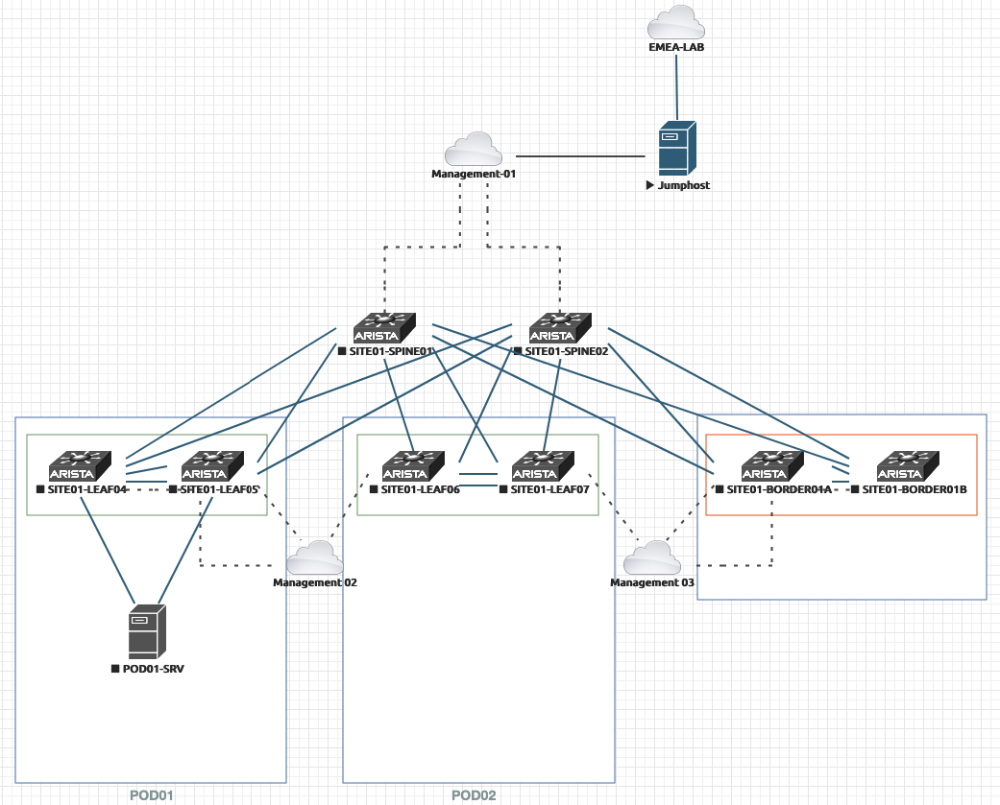

# AVD with eAPI deployment



## Information

- [EVE NG Topology](medias/eve-topology.zip)

Topology URL: [EVE-NG-02 EMEA LAB](https://eve-ng2.lon.aristanetworks.com/legacy/tgrimonet/BNP-AS-Engagement.unl/topology)

### Authentication

_EOS Admin:_

- Username: `admin`
- Password: `arista123`

_Admin Username:_

- Username: `ansible`
- Password: `ansible`

### Topology Information

### Jumphost

VM uses DHCP for IP allocation on EMEA Lab so IP might change

- IP: 10.83.31.71

### Out of band IP Addresses

- SITE01-SPINE01: `10.255.0.101`
  - Expose SSH Port: `2001`
  - Expose eAPI Port: `3001`
- SITE01-SPINE02: `10.255.0.102`
  - Expose SSH Port: `2002`
  - Expose eAPI Port: `3002`
- SITE01-LEAF01A: `10.255.0.103`
  - Expose SSH Port: `2003`
  - Expose eAPI Port: `3003`
- SITE01-LEAF01B: `10.255.0.104`
  - Expose SSH Port: `2004`
  - Expose eAPI Port: `3004`
- SITE01-LEAF02A: `10.255.0.105`
  - Expose SSH Port: `2005`
  - Expose eAPI Port: `3005`
- SITE01-LEAF02B: `10.255.0.106`
  - Expose SSH Port: `2006`
  - Expose eAPI Port: `3006`
- SITE01-BORDER01A: `10.255.0.107`
  - Expose SSH Port: `2007`
  - Expose eAPI Port: `3007`
- SITE01-BORDER01B: `10.255.0.108`
  - Expose SSH Port: `2008`
  - Expose eAPI Port: `3008`

__Servers and routers__

- POD01-SRV: `10.255.0.11`
  - Expose SSH Port: `2011`
  - Expose eAPI Port: `3011`

To connect:

```shell
# SSH Access
$ ssh admin@<jumphost-ip>:200x

# eAPI
$ curl -i -k https://<jumphost-ip>:300x
```

#### Subnet allocation

- Underlay:  172.31.255.0/24
- Loopback EVPN Control Plane: 192.168.255.0/24
- Loopback for VTEP: 192.168.254.0/24
- MLAG Subnet: 10.255.251.0/24
- MLAG Peer: 10.255.252.0/24

#### Tenants definition

TBD
