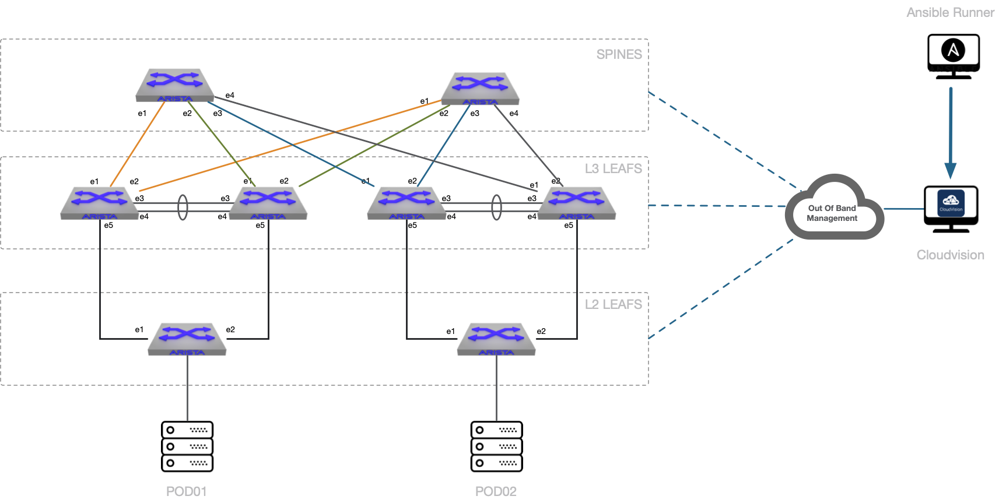

# Virtual Lab 01



```yaml
# CVP Servers definition
cvp_sync:
    hosts:
    cv_server1:
    cv_server2:
CVP:
    hosts:
    cv_ztp:     # SSH Access
    cv_server:  # Rest API Access

# DC1_Fabric - EVPN Fabric running in home lab
DC1:
    children:
    DC1_FABRIC:
        children:
        DC1_SPINES:
            hosts:
            DC1-SPINE1:
                ansible_host: 10.255.0.11
            DC1-SPINE2:
                ansible_host: 10.255.0.12
        DC1_L3LEAFS:
            children:
            DC1_LEAF1:
                hosts:
                DC1-LEAF1A:
                    ansible_host: 10.255.0.13
                DC1-LEAF1B:
                    ansible_host: 10.255.0.14
            DC1_LEAF2:
                hosts:
                DC1-LEAF2A:
                    ansible_host: 10.255.0.15
                DC1-LEAF2B:
                    ansible_host: 10.255.0.16
        DC1_L2LEAFS:
            children:
            DC1_L2LEAF1:
                hosts:
                DC1-L2LEAF1A:
                    ansible_host: 10.255.0.17
            DC1_L2LEAF2:
                hosts:
                DC1-L2LEAF2A:
                    ansible_host: 10.255.0.18
    DC1_TENANTS_NETWORKS:
        children:
        DC1_L3LEAFS:
        DC1_L2LEAFS:
    DC1_SERVERS:
        children:
        DC1_L3LEAFS:
        DC1_L2LEAFS:
```
