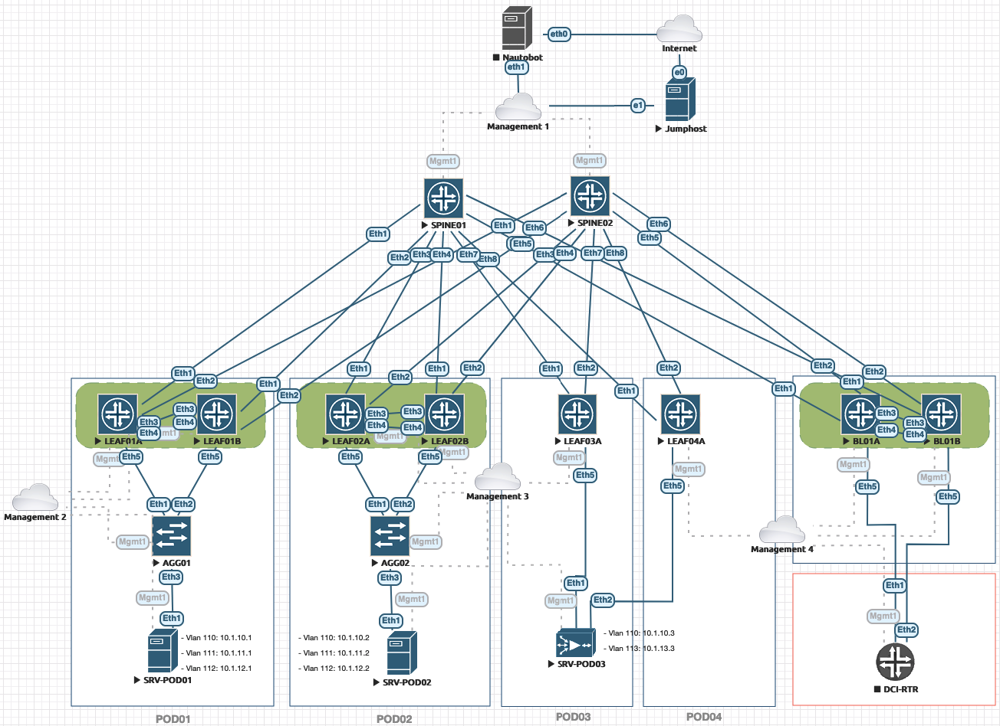

# AVD with eAPI deployment

## Information

- [EVE NG Topology](medias/eve-topology.zip)

### Authentication:
  - Username: ansible
  - Password: ansible

### Topology Information:

#### Nodes Version

- vEOS-LAB: `4.24.0F`
- Centos: `7`

#### Subnet allocation:

- Underlay:  172.31.255.0/24
- Loopback EVPN Control Plane: 192.168.255.0/24
- Loopback for VTEP: 192.168.254.0/24
- MLAG Subnet: 10.255.251.0/24
- MLAG Peer: 10.255.252.0/24

#### Tenants definition:

- __Tenant A__
  - _Project 01_
    - PR01-DMZ --> vlan `110` / `10.1.10.0/24`
    - PR01-TRUST --> vlan `111` / `10.1.11.0/24`
  - _Project 02_
    - PR02-DMZ --> vlan `112` / `10.1.12.0/24`
- __Tenant B__
  - _Pure L2VLAN_
    - B-ELAN-201 --> vlan `201` / `10.2.1.0/24`
