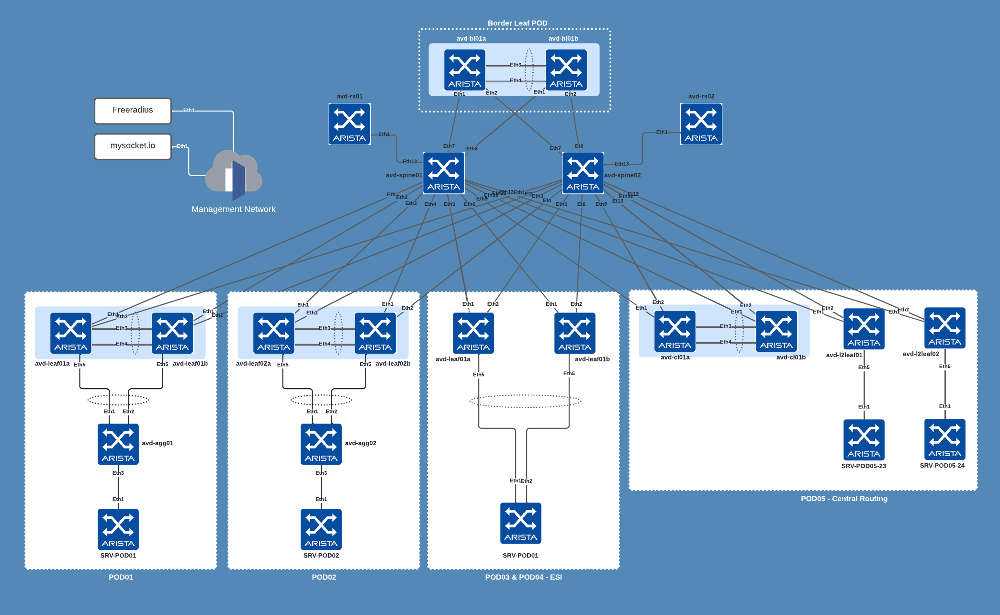

# CLAB Topology

## Credentials

- `admin` / nopasswd
- `ansible` / `ansible`

## Management IP Addresses

| POD | Type | Node | Management IP | Platform | Provisioned in CloudVision |
| --- | ---- | ---- | ------------- | -------- | -------------------------- |
| fabric | edge | avd-agg01 | 10.73.254.21/24 | cEOS-LAB | Provisioned |
| fabric | edge | avd-agg02 | 10.73.254.22/24 | cEOS-LAB | Provisioned |
| fabric | l3leaf | avd-bl01a | 10.73.254.15/24 | cEOS-LAB | Provisioned |
| fabric | l3leaf | avd-bl01b | 10.73.254.16/24 | cEOS-LAB | Provisioned |
| fabric | l3leaf | avd-cl01a | 10.73.254.19/24 | cEOS-LAB | Provisioned |
| fabric | l3leaf | avd-cl01b | 10.73.254.20/24 | cEOS-LAB | Provisioned |
| fabric | l2leaf | avd-l2leaf01 | 10.73.254.31/24 | cEOS-LAB | Provisioned |
| fabric | l2leaf | avd-l2leaf02 | 10.73.254.32/24 | cEOS-LAB | Provisioned |
| fabric | l3leaf | avd-leaf1a | 10.73.254.11/24 | cEOS-LAB | Provisioned |
| fabric | l3leaf | avd-leaf1b | 10.73.254.12/24 | cEOS-LAB | Provisioned |
| fabric | l3leaf | avd-leaf2a | 10.73.254.13/24 | cEOS-LAB | Provisioned |
| fabric | l3leaf | avd-leaf2b | 10.73.254.14/24 | cEOS-LAB | Provisioned |
| fabric | l3leaf | avd-leaf3a | 10.73.254.17/24 | cEOS-LAB | Provisioned |
| fabric | l3leaf | avd-leaf4a | 10.73.254.18/24 | cEOS-LAB | Provisioned |
| fabric | route_server | avd-rs01 | 10.73.254.51/24 | cEOS-LAB | Provisioned |
| fabric | route_server | avd-rs02 | 10.73.254.52/24 | cEOS-LAB | Provisioned |
| fabric | spine | avd-spine1 | 10.73.254.101/24 | cEOS-LAB | Provisioned |
| fabric | spine | avd-spine2 | 10.73.254.102/24 | cEOS-LAB | Provisioned |

## Loopback0 Interfaces Node Allocation

| POD | Node | Loopback0 |
| --- | ---- | --------- |
| fabric | avd-bl01a | 192.168.255.19/32 |
| fabric | avd-bl01b | 192.168.255.20/32 |
| fabric | avd-cl01a | 192.168.255.21/32 |
| fabric | avd-cl01b | 192.168.255.22/32 |
| fabric | avd-l2leaf01 | 192.168.253.22/32 |
| fabric | avd-l2leaf02 | 192.168.253.23/32 |
| fabric | avd-leaf1a | 192.168.255.13/32 |
| fabric | avd-leaf1b | 192.168.255.14/32 |
| fabric | avd-leaf2a | 192.168.255.15/32 |
| fabric | avd-leaf2b | 192.168.255.16/32 |
| fabric | avd-leaf3a | 192.168.255.17/32 |
| fabric | avd-leaf4a | 192.168.255.18/32 |
| fabric | avd-rs01 | 192.168.0.26/32 |
| fabric | avd-rs02 | 192.168.0.27/32 |
| fabric | avd-spine1 | 192.168.1.1/32 |
| fabric | avd-spine2 | 192.168.1.2/32 |

## VTEP Loopback Node allocation

| POD | Node | Loopback1 |
| --- | ---- | --------- |
| fabric | avd-bl01a | 192.168.254.19/32 |
| fabric | avd-bl01b | 192.168.254.19/32 |
| fabric | avd-cl01a | 192.168.254.21/32 |
| fabric | avd-cl01b | 192.168.254.21/32 |
| fabric | avd-l2leaf01 | 192.168.252.22/32 |
| fabric | avd-l2leaf02 | 192.168.252.23/32 |
| fabric | avd-leaf1a | 192.168.254.13/32 |
| fabric | avd-leaf1b | 192.168.254.13/32 |
| fabric | avd-leaf2a | 192.168.254.15/32 |
| fabric | avd-leaf2b | 192.168.254.15/32 |
| fabric | avd-leaf3a | 192.168.254.17/32 |
| fabric | avd-leaf4a | 192.168.254.18/32 |
